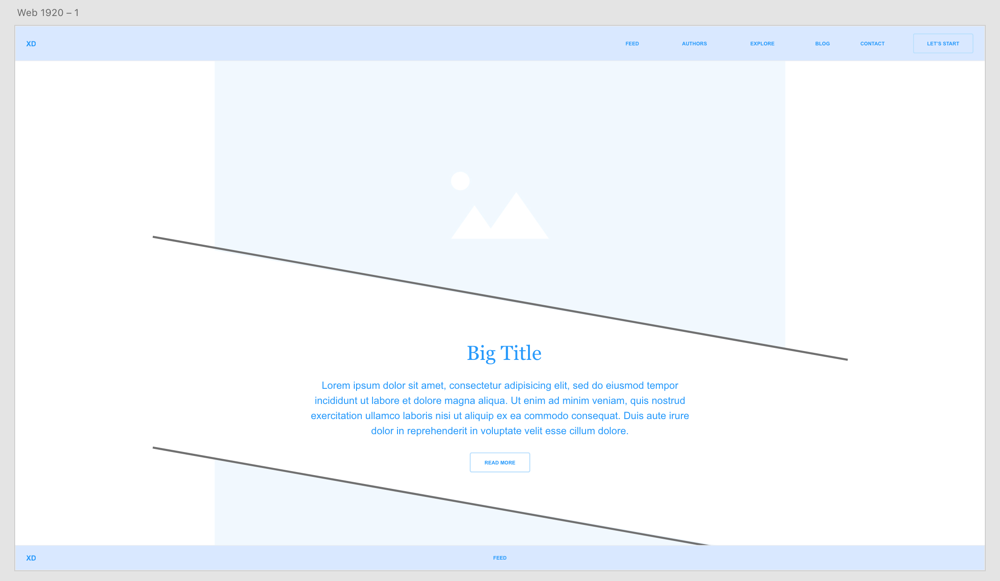

#MentalHealthable
General Assembly Project 1
_A curated feed for all your modern mental health needs._

##Aims
###Core Goal
MentalHealthable will use NewsAPI V2 to feature curated feeds of content related to mental health technology. 
###Stretch Goals
Utilizing the Youtube, Instagram, and Inspirational Quotes APIs to intersperse unique and original content into the curated feeds. Including advanced alt tags and descriptions for accessibility readers. 

##Methods
###Overview
Using Google Search Console to avoid personal bias in keyword selection, MentalHealthable will create a main feed by selecting multiple keywords related to positive mental health content ("mindfulness", "inspiration", "mood", etc.) and technology ("apps", "wearables", "trackers").
###Structure
Each related term will use "OR" tags, while categories will be concatenated with an "AND" tag, as allowed by the advanced NewsAPI query, casting a wide net across news media and blogging websites. Certain anti-keywords will be utilized to avoid including any potentially triggering or graphic content. Category specific pages ("tech", "apps", etc.) would contain content specific to each category; a search function would be available to reference all queries in the NewsAPI database.
###Pseudocode
1. 
2. 
3. 

##Design
###Overview
Immersive, fullwidth design with minimal content and backgrounds, a simple color palette, and advanced CSS elements such as box shadows, parralax scrolling, and interactice hover elements– putting the API-called content front and center, allowing for a pleasant viewing experience– will be utilized. For accessibility needs, MentalHealthable will feature full WCAG 2.0 compliance and restricted use of low-contrast or low-transparency elements.
###Pages
*index.html
*tech.html
*apps.html
*style.css
*script.js
###Mockups
Desktop Mockup:

Tablet Mockup:

Mobile Mockup:

##Content Delivery
###Hosting
Dreamhost VPS _(if allowed, in lieu of Surge)_
###Domain
https://www.mentalhealthable.com